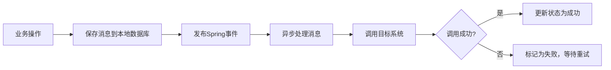
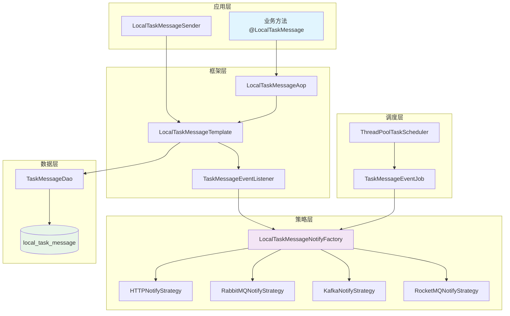
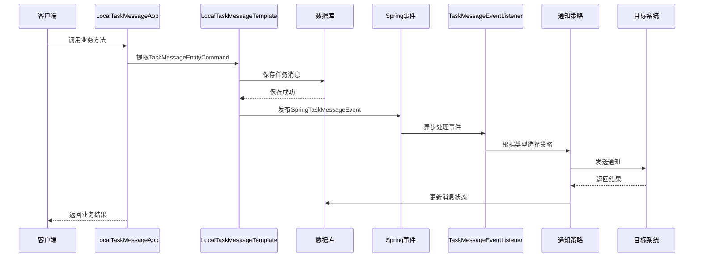
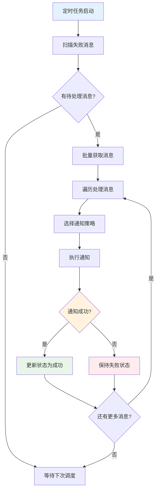

# 🚀 Winter Local Message Spring Boot Starter

<div align="center">


**🎯 一个基于Spring Boot的本地任务消息可靠投递框架**

*支持HTTP、RabbitMQ、Kafka、RocketMQ多种通知方式的可靠消息投递解决方案*

</div>

---

## 📋 目录

- [✨ 特性](#-特性)
- [🎯 解决的问题](#-解决的问题)
- [🏗️ 技术架构](#️-技术架构)
- [🔧 工作原理](#-工作原理)
- [📊 流程图](#-流程图)
- [🚀 快速开始](#-快速开始)
- [⚙️ 配置说明](#️-配置说明)
- [📖 使用示例](#-使用示例)
- [🔄 重试机制](#-重试机制)
- [🤝 贡献指南](#-贡献指南)
- [📄 许可证](#-许可证)

---

## ✨ 特性

🎯 **多种通知方式**
- 🌐 HTTP接口调用
- 🐰 RabbitMQ消息队列
- 🚀 Apache Kafka
- 🚀 Apache RocketMQ

🔒 **可靠性保证**
- 📝 先入库再发送，保证消息不丢失
- 🔄 自动重试机制，支持失败重试
- 🏠 门牌号分片，支持水平扩展
- 📊 状态跟踪，实时监控消息状态

⚡ **高性能**
- 🔀 异步处理，不阻塞主业务流程
- 🎯 策略模式，支持动态扩展通知方式
- 🧵 多线程调度，支持并发处理
- 📈 批量处理，提升处理效率

🛠️ **易于使用**
- 🏷️ 注解驱动，零侵入集成
- 🔧 自动配置，开箱即用
- 📋 灵活配置，支持多任务组
- 🎨 Spring Boot Starter，标准化集成

---

## 🎯 解决的问题

### 💼 业务场景

在分布式系统中，我们经常遇到以下问题：

1. **🔄 异步通知可靠性**：如何保证重要业务事件的通知不丢失？
2. **⚡ 性能与一致性**：如何在保证性能的同时确保消息投递的可靠性？
3. **🔧 系统解耦**：如何降低业务系统与消息中间件的耦合度？
4. **📊 监控与重试**：如何有效监控消息投递状态并处理失败重试？

### 🎯 解决方案

本框架采用 **"先入库再发送"** 的可靠消息投递模式：



---

## 🏗️ 技术架构

### 📚 核心依赖

| 技术栈 | 版本 | 用途 |
|--------|------|------|
|  | 2.6.11 | 核心框架 |
|  | 2.6.11 | 切面编程 |
|  | 5.8.25 | 工具库 |
|  | 1.18.30 | 代码简化 |
|  | 2.3.0 | 消息队列 |
|  | 2.8.11 | 消息队列 |
|  | 2.6.11 | 消息队列 |

### 🏛️ 架构设计



---

## 🔧 工作原理

### 🎯 核心流程

1. **📝 注解拦截**：AOP切面拦截带有`@LocalTaskMessage`注解的方法
2. **💾 消息入库**：将任务消息保存到本地数据库，确保持久化
3. **📢 事件发布**：发布Spring事件，触发异步处理
4. **🔄 异步处理**：事件监听器异步处理消息通知
5. **📊 状态更新**：根据处理结果更新消息状态
6. **⏰ 定时重试**：定时任务扫描失败消息进行重试

### 🏠 分片策略

采用**门牌号（houseNumber）**进行数据分片：

```java
// 门牌号计算规则
int houseNumber = Math.abs(taskId.hashCode()) % 100;
```

支持配置多个任务组，每个组负责不同的门牌号范围，实现水平扩展。

---

## 📊 流程图

### 🔄 消息处理时序图



### 🔄 重试机制流程图



---

## 🚀 快速开始

### 📦 1. 添加依赖

```xml
<dependency>
    <groupId>com.zsq</groupId>
    <artifactId>winter-local-message-spring-boot-starter</artifactId>
    <version>0.0.1</version>
</dependency>
```

### 🗄️ 2. 创建数据表

```sql
CREATE TABLE `local_task_message` (
  `id` bigint NOT NULL AUTO_INCREMENT COMMENT '自增主键',
  `task_id` varchar(64) NOT NULL COMMENT '任务ID',
  `task_name` varchar(128) NOT NULL COMMENT '任务名称',
  `notify_type` varchar(32) NOT NULL COMMENT '通知类型',
  `notify_config` text NOT NULL COMMENT '通知配置JSON',
  `status` tinyint NOT NULL DEFAULT '0' COMMENT '状态 0-待处理 1-处理中 2-已完成 3-失败',
  `parameter_json` text COMMENT '业务参数JSON',
  `house_number` int NOT NULL COMMENT '门牌号',
  `create_time` datetime NOT NULL DEFAULT CURRENT_TIMESTAMP COMMENT '创建时间',
  `update_time` datetime NOT NULL DEFAULT CURRENT_TIMESTAMP ON UPDATE CURRENT_TIMESTAMP COMMENT '更新时间',
  PRIMARY KEY (`id`),
  UNIQUE KEY `uk_task_id` (`task_id`),
  KEY `idx_house_number_status` (`house_number`, `status`),
  KEY `idx_create_time` (`create_time`)
) ENGINE=InnoDB DEFAULT CHARSET=utf8mb4 COMMENT='本地任务消息表';
```

### ⚙️ 3. 配置文件

```yaml
# application.yml
winter-local-task-message:
  groups:
    - group-id: "order-group"           # 订单相关任务组
      house-numbers: [0, 1, 2, 3, 4]   # 负责门牌号 0-4
      cron: "0/10 * * * * ?"            # 每10秒执行一次
      limit: 50                         # 每次处理50条消息
    - group-id: "payment-group"         # 支付相关任务组  
      house-numbers: [5, 6, 7, 8, 9]   # 负责门牌号 5-9
      fixed-delay-ms: 5000              # 固定延迟5秒
      limit: 100                        # 每次处理100条消息
```

---

## ⚙️ 配置说明

### 📋 配置参数详解

| 参数 | 类型 | 必填 | 默认值 | 说明 |
|------|------|------|--------|------|
| `group-id` | String | 否 | "default" | 任务组标识，用于日志区分 |
| `house-numbers` | List<Integer> | 是 | [] | 负责的门牌号列表 |
| `cron` | String | 否 | - | Cron表达式，与fixed-delay-ms二选一 |
| `fixed-delay-ms` | Long | 否 | - | 固定延迟毫秒数 |
| `limit` | Integer | 否 | 100 | 每次批量处理的消息数量 |

### 🎯 门牌号分配策略

```java
// 推荐按业务模块分配门牌号
- 订单模块：0-19
- 支付模块：20-39  
- 用户模块：40-59
- 商品模块：60-79
- 其他模块：80-99
```

---

## 📖 使用示例

### 🏷️ 1. 注解方式使用

```java
@Service
public class OrderService {
    
    /**
     * 订单支付成功后发送通知
     */
    @LocalTaskMessage
    @Transactional
    public void processPaymentSuccess(TaskMessageEntityCommand notifyCommand) {
        // 1. 更新订单状态
        orderRepository.updateStatus(orderId, OrderStatus.PAID);
        
        // 2. 框架自动处理消息通知（notifyCommand会被自动提取并处理）
        log.info("订单支付成功，准备发送通知");
    }
    
    /**
     * 指定参数名的方式
     */
    @LocalTaskMessage(entityAttributeName = "command")
    @Transactional  
    public void processOrderCancel(TaskMessageEntityCommand command, String orderId) {
        // 业务逻辑
        orderRepository.updateStatus(orderId, OrderStatus.CANCELLED);
    }
    
    /**
     * 从复杂对象中提取命令
     */
    @LocalTaskMessage(entityAttributeName = "request.notifyCommand")
    @Transactional
    public void processComplexOrder(OrderProcessRequest request) {
        // 业务逻辑
        // request.getNotifyCommand() 会被自动提取
    }
}
```

### 📤 2. 编程方式发送
```yaml
server:
  port: 8091

# 数据库配置；启动时配置数据库资源信息
spring:
  datasource:
    username: root
    password: root
    url: jdbc:mysql://127.0.0.1:3306/test?useUnicode=true&characterEncoding=utf8&autoReconnect=true&zeroDateTimeBehavior=convertToNull&serverTimezone=Asia/Shanghai&useSSL=true&sessionVariables=sql_mode='NO_ENGINE_SUBSTITUTION,STRICT_TRANS_TABLES'
    driver-class-name: com.mysql.cj.jdbc.Driver
    type: com.zaxxer.hikari.HikariDataSource
    hikari:
      pool-name: Retail_HikariCP
      minimum-idle: 15 #最小空闲连接数量
      idle-timeout: 180000 #空闲连接存活最大时间，默认600000（10分钟）
      maximum-pool-size: 25 #连接池最大连接数，默认是10
      auto-commit: true  #此属性控制从池返回的连接的默认自动提交行为,默认值：true
      max-lifetime: 1800000 #此属性控制池中连接的最长生命周期，值0表示无限生命周期，默认1800000即30分钟
      connection-timeout: 30000 #数据库连接超时时间,默认30秒，即30000
      connection-test-query: SELECT 1
  # RabbitMQ
#  rabbitmq:
#    addresses: 127.0.0.1
#    port: 15672
#    username: admin
#    password: YourSecurePassword123!
#    listener:
#      simple:
#        prefetch: 1 # 每次投递n个消息，消费完在投递n个
#    template:
#      delivery-mode: persistent # 确保全局默认设置为持久化（可选）
#    # 消息配置
#    config:
#      # 生产者
#      producer:
#        # 绑定交换机，统一一套交换机
#        exchange: ltm_test_exchange
#        # 消息主题配置；路由key、队列
#        topic_order_success:
#          # 消息主题
#          routing_key: topic.order_success
#          # 消费队列
#          queue: ltm_test_queue_2_order_success
rocketmq:
  name-server: 127.0.0.1:9876   # NameServer 地址（多个用分号隔开，如：ip1:port;ip2:port）
  producer:
    group: my-producer-group     # 生产者组名（必须配置）
    # 可选配置
    send-message-timeout: 3000   # 发送超时（毫秒）
    retry-times-when-send-failed: 2
  consumer:
    # 消费者配置
    pull-batch-size: 10
    enable-msg-trace: true
    customized-trace-topic: RMQ_SYS_TRACE_TOPIC
# MyBatis 配置【如需使用记得打开】
mybatis:
  mapper-locations: classpath:/mybatis/mapper/*.xml
  config-location:  classpath:/mybatis/config/mybatis-config.xml


logging:
  level:
    root: info
  config: classpath:logback-spring.xml
winter-local-task-message:
  groups:
    # 使用 cron 表达式调度（每 10 秒执行一次）
    - groupId: group01
      houseNumbers: [ 0, 1, 2, 3 ]
      cron: "0/10 * * * * ?"
      limit: 100
    # 使用固定延迟调度（每 5 秒执行一次）
    - groupId: group02
      houseNumbers: [ 4, 5, 6, 7, 8, 9 ]
      fixedDelayMs: 5000
      limit: 50
```
模拟测试发送消息类
```java
package cn.bugstack.wrench.local.task.message.test.notify;


import com.zsq.winter.local.message.LocalTaskMessageTemplate;
import com.zsq.winter.local.message.entity.TaskMessageEntityCommand;
import com.zsq.winter.local.message.enums.TaskNotifyEnum;
import lombok.extern.slf4j.Slf4j;
import org.junit.Test;
import org.junit.runner.RunWith;
import org.springframework.boot.test.context.SpringBootTest;
import org.springframework.test.context.junit4.SpringRunner;

import javax.annotation.Resource;
import java.util.concurrent.CountDownLatch;

@Slf4j
@RunWith(SpringRunner.class)
@SpringBootTest
public class Notify2RocketMQTest {

  @Resource
  private LocalTaskMessageTemplate handleService;

  @Test
  public void test() throws InterruptedException {
    // 准备测试数据
    String topic = "test-topic";
    String tag = "test-tag";
    String key = "test-key";

    TaskMessageEntityCommand command1 = new TaskMessageEntityCommand();
    command1.setTaskId("TASK_NEW_25111502");
    command1.setTaskName("gpt调用测试任务");
    command1.setNotifyType(TaskNotifyEnum.ROCKET_MQ.getCode());
    command1.setNotifyConfig(
            TaskMessageEntityCommand.NotifyConfig.builder()
                    .rocketMQ(TaskMessageEntityCommand.NotifyConfig.RocketMQ.builder()
                            .topic(topic)
                            .tag(tag)
                            .key(key)
                            .build())
                    .build());
    command1.setStatus(0);
    command1.setParameterJson("{\"model\": \"gpt-4o\", \"messages\": [{\"role\": \"user\", \"content\": \"1+1\"}]}");

    handleService.acceptTaskMessage(command1);

    new CountDownLatch(1).await();
  }

}

```

模拟rocketmq下游监听消息类
```java
package cn.bugstack.wrench.local.task.message.trigger.listener;

import com.alibaba.fastjson.JSON;
import com.zsq.winter.local.message.entity.TaskMessageEntityCommand;
import lombok.extern.slf4j.Slf4j;
import org.apache.rocketmq.spring.annotation.RocketMQMessageListener;
import org.apache.rocketmq.spring.core.RocketMQListener;
import org.springframework.stereotype.Component;

/**
 * RocketMQ 消费者：处理字符串消息并解析为 TaskMessageEntityCommand
 */
@Slf4j
@Component
@RocketMQMessageListener(
        topic = "test-topic",
        consumerGroup = "task-message-consumer-group", // 自定义消费者组名，全局唯一
        selectorExpression = "test-tag" // 只消费 tag = "test-tag" 的消息（可选）
)
public class TaskMessageConsumer implements RocketMQListener<String> {

    @Override
    public void onMessage(String messageJson) {
        try {
            log.info("🚀 收到原始消息字符串: {}", messageJson);
            
            if (messageJson == null || messageJson.trim().isEmpty()) {
                log.error("❌ 收到的消息为空！");
                return;
            }

            // 这里收到的实际上是 parameterJson，需要根据业务逻辑处理
            log.info("� 参数 J消SON 内容: {}", messageJson);

            // 根据消息内容执行业务逻辑
            processMessage(messageJson);

        } catch (Exception e) {
            // ⚠️ 注意：如果抛出异常，消息会重试（取决于重试策略）
            log.error("❌ 消费消息失败: {}", e.getMessage(), e);
            // 根据业务决定是否 rethrow
            // throw new RuntimeException(e);
        }
    }

    /**
     * 处理消息业务逻辑
     * @param parameterJson 参数JSON字符串
     */
    private void processMessage(String parameterJson) {
        try {
            // 解析参数JSON
            Object params = JSON.parse(parameterJson);
            log.info("✅ 成功解析参数: {}", params);

            // TODO: 在这里执行你的业务逻辑
            // 例如：调用 GPT、保存数据库、触发下游服务等
            
            // 示例：如果是GPT调用参数
            if (parameterJson.contains("gpt-4o")) {
                log.info("🤖 检测到GPT调用请求，开始处理...");
                // 这里可以调用GPT API
            }

            log.info("✅ 消息处理完成");

        } catch (Exception e) {
            log.error("❌ 处理消息业务逻辑失败: {}", e.getMessage(), e);
            throw e;
        }
    }
}
```


---

## 🔄 重试机制

### ⚙️ 重试策略

- **🔄 自动重试**：定时任务自动扫描失败消息进行重试
- **📊 状态管理**：
  - `0` - 待处理
  - `1` - 处理中  
  - `2` - 已完成
  - `3` - 失败（等待重试）
- **🎯 智能调度**：支持多任务组并行处理不同门牌号范围
- **📈 批量处理**：每次批量获取消息，提升处理效率

### 📊 监控建议

```sql
-- 查看消息处理统计
SELECT 
    notify_type,
    status,
    COUNT(*) as count,
    DATE(create_time) as date
FROM local_task_message 
WHERE create_time >= DATE_SUB(NOW(), INTERVAL 7 DAY)
GROUP BY notify_type, status, DATE(create_time)
ORDER BY date DESC;

-- 查看失败消息
SELECT * FROM local_task_message 
WHERE status = 3 
ORDER BY create_time DESC 
LIMIT 10;
```

---

## 🤝 贡献指南

我们欢迎所有形式的贡献！🎉

### 🔧 开发环境

- ☕ JDK 1.8+
- 📦 Maven 3.6+
- 🍃 Spring Boot 2.6+
- 🗄️ MySQL 5.7+

### 📝 提交规范

```bash
# 功能开发
git commit -m "feat: 添加邮件通知策略"

# Bug修复  
git commit -m "fix: 修复重试机制的并发问题"

# 文档更新
git commit -m "docs: 更新使用示例"
```

### 🚀 发布流程

1. 🍴 Fork 项目
2. 🌿 创建特性分支 (`git checkout -b feature/AmazingFeature`)
3. 💾 提交更改 (`git commit -m 'Add some AmazingFeature'`)
4. 📤 推送分支 (`git push origin feature/AmazingFeature`)
5. 🔄 创建 Pull Request

---

## 📄 许可证

本项目采用 MIT 许可证 - 查看 [LICENSE](LICENSE) 文件了解详情。

---

<div align="center">

**⭐ 如果这个项目对你有帮助，请给我们一个星标！**

Made with ❤️ by [zsq](https://github.com/hahaha-zsq)

</div>